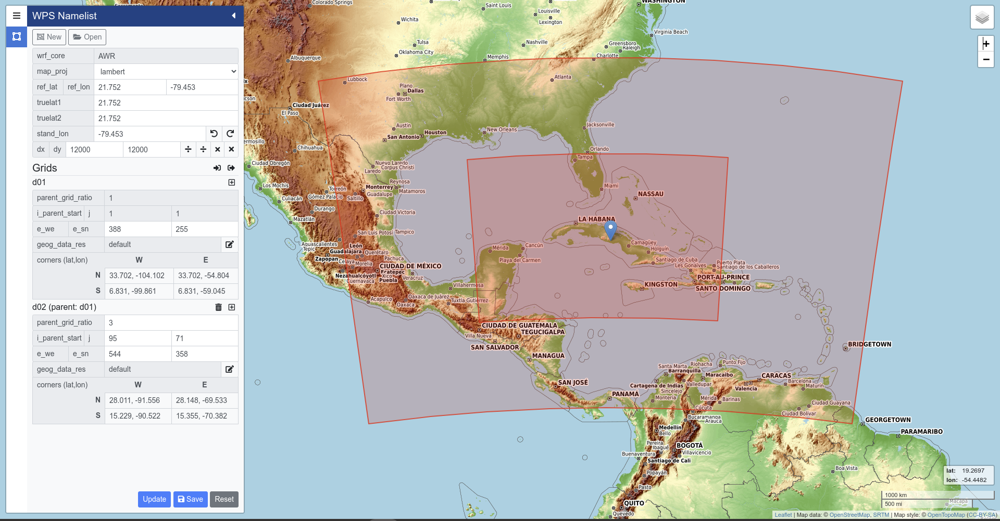

# WRF Domain Wizard 

## Link:
https://aluislfh.github.io/WRFDomainWizard-Online/

## Screenshot

## Descripción:

Herramienta web diseñada para la creación, diseño y visualización de dominios en simulaciones con el modelo WRF. Su principal función es facilitar la configuración y análisis de dominios en el contexto de simulaciones meteorológicas, ofreciendo una alternativa moderna a herramientas como WRF Wizard Domain (versión en Java para PC). Esta herramienta permite a los usuarios definir y modificar parámetros de dominios, visualizar en tiempo real los cambios y ajustes, y exportar los diseños para su utilización en simulaciones WRF. Con un enfoque en la usabilidad y la interactividad, esta solución basada en web es accesible desde distintos dispositivos y navegadores, asegurando una experiencia de usuario coherente y eficiente.

## Description:

Web tool designed for the creation, design, and visualization of domains in WRF model simulations. Its main function is to facilitate the configuration and analysis of domains within the context of meteorological simulations, offering a modern alternative to tools like WRF Wizard Domain (Java version for PCs). This tool allows users to define and modify domain parameters, visualize changes and adjustments in real time, and export the designs for use in WRF simulations. Focused on usability and interactivity, this web-based solution is accessible from various devices and browsers, ensuring a consistent and efficient user experience.

## Authors

* **Jiri Richter** - *Initial work* - [JiriRichter](https://github.com/JiriRichter) - [Original Demo](https://jiririchter.github.io/WRFDomainWizard/)

## License

This project is licensed under the GNU GPLv3 License - see the [LICENSE](LICENSE) file for details

